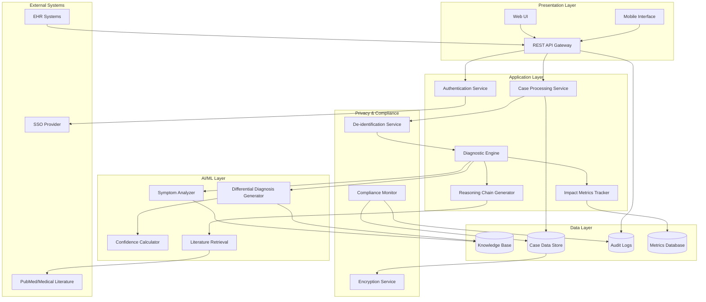

# Design Document: AI Clinical Reasoning Engine for Rare & Complex Cases

## Overview

The AI Clinical Reasoning Engine is a production-ready clinical decision support system designed to assist healthcare professionals in diagnosing rare and complex medical cases. The system combines advanced AI reasoning with explainability, privacy compliance, and measurable impact tracking to reduce diagnostic delays and improve patient outcomes globally.

### Core Design Principles

1. **Clinical Safety First**: All outputs include disclaimers, uncertainty quantification, and safety guardrails
2. **Explainable AI**: Every diagnostic suggestion includes transparent reasoning chains with medical literature citations
3. **Privacy by Design**: De-identification, encryption, and compliance built into every layer
4. **Measurable Impact**: Comprehensive tracking of lives helped, diagnostic delays reduced, and cost savings
5. **Scalable Architecture**: Cloud-native design supporting global deployment with 99.9% uptime
6. **Interoperability**: Standards-based integration (HL7 FHIR, REST APIs) with existing healthcare systems

### Key Capabilities

- Process complex cases with 50+ symptoms in under 30 seconds
- Generate ranked differential diagnoses with confidence intervals
- Provide step-by-step reasoning chains with literature citations
- Track and report impact metrics (lives helped, time saved, costs reduced)
- Maintain HIPAA, GDPR, and PIPEDA compliance
- Support 10,000+ diseases including rare conditions
- Scale to 1,000+ concurrent users globally

## Architecture

### High-Level Architecture



### Deployment Architecture

The system follows a cloud-native, microservices architecture with the following characteristics:

- **Multi-region deployment**: Primary and secondary regions for disaster recovery
- **Auto-scaling**: Kubernetes-based orchestration with horizontal pod autoscaling
- **Load balancing**: Global load balancer with health checks and failover
- **Data replication**: Synchronous replication for critical data, asynchronous for analytics
- **Edge caching**: CDN for static assets and API response caching where appropriate

### Technology Stack Recommendations

- **API Gateway**: Kong or AWS API Gateway with rate limiting and authentication
- **Backend Services**: Python (FastAPI) or Node.js (Express) for microservices
- **AI/ML Framework**: PyTorch or TensorFlow for model serving, with ONNX for interoperability
- **Database**: PostgreSQL for structured data, MongoDB for unstructured clinical notes
- **Search Engine**: Elasticsearch for knowledge base queries and literature retrieval
- **Message Queue**: Apache Kafka or RabbitMQ for asynchronous processing
- **Caching**: Redis for session management and frequently accessed data
- **Monitoring**: Prometheus + Grafana for metrics, ELK stack for logs
- **Container Orchestration**: Kubernetes (EKS, GKE, or AKS)

## Components and Interfaces

### 1. Case Processing Service

**Responsibility**: Intake, validation, and preprocessing of clinical cases

**Key Functions**:
- `ingestCase(caseData: CaseInput): CaseID` - Accepts case data from UI or API
- `validateCase(caseID: CaseID): ValidationResult` - Checks data completeness and quality
- `identifyMissingData(caseID: CaseID): MissingDataList` - Identifies critical missing information
- `preprocessCase(caseID: CaseID): ProcessedCase` - Normalizes and structures case data

**Interfaces**:
```typescript
interface CaseInput {
  patientAge: number;
  patientSex: string;
  symptoms: Symptom[];
  medicalHistory: MedicalHistory;
  labResults: LabResult[];
  imagingFindings: ImagingFinding[];
  medications: Medication[];
  clinicalNotes: string;
}

interface Symptom {
  code: string; // SNOMED CT or ICD code
  description: string;
  onset: Date;
  severity: number; // 1-10 scale
  progression: string; // "improving" | "stable" | "worsening"
}

interface ValidationResult {
  isValid: boolean;
  qualityScore: number; // 0-100
  missingCriticalData: string[];
  warnings: string[];
}
```

### 2. De-identification Service

**Responsibility**: Remove or mask personally identifiable information (PII) while preserving clinical utility

**Key Functions**:
- `deIdentify(caseData: ProcessedCase): DeIdentifiedCase` - Removes all PII
- `reIdentify(caseID: CaseID, authorizedUser: UserID): ProcessedCase` - Restores PII for authorized access
- `generatePseudonym(patientID: string): string` - Creates consistent pseudonyms for tracking

**Privacy Techniques**:
- Named entity recognition (NER) to identify PII in clinical notes
- Date shifting (maintaining relative time intervals)
- Geographic generalization (zip code → region)
- Pseudonymization with secure key management

### 3. Diagnostic Engine

**Responsibility**: Core AI reasoning for differential diagnosis generation

**Key Functions**:
- `generateDifferentialDiagnosis(case: DeIdentifiedCase): DifferentialDiagnosis` - Main diagnostic function
- `rankDiagnoses(candidates: Diagnosis[]): RankedDiagnosis[]` - Prioritizes diagnoses
- `calculateConfidence(diagnosis: Diagnosis, case: DeIdentifiedCase): ConfidenceInterval` - Computes confidence scores

**Interfaces**:
```typescript
interface DifferentialDiagnosis {
  caseID: CaseID;
  diagnoses: RankedDiagnosis[];
  processingTime: number;
  modelVersion: string;
  timestamp: Date;
}

interface RankedDiagnosis {
  rank: number;
  diseaseCode: string; // ICD-10 or SNOMED CT
  diseaseName: string;
  confidence: ConfidenceInterval;
  supportingEvidence: Evidence[];
  contradictingEvidence: Evidence[];
  urgencyLevel: "critical" | "high" | "moderate" | "low";
  recommendedActions: string[];
}

interface ConfidenceInterval {
  point: number; // 0-100
  lower: number; // Lower bound of 95% CI
  upper: number; // Upper bound of 95% CI
}
```

### 4. Symptom Analyzer

**Responsibility**: Extract and analyze symptom patterns from case data

**Key Functions**:
- `extractSymptoms(case: DeIdentifiedCase): SymptomProfile` - Identifies all symptoms
- `analyzeTemporalPatterns(symptoms: Symptom[]): TemporalPattern` - Detects progression patterns
- `identifySymptomClusters(symptoms: Symptom[]): SymptomCluster[]` - Groups related symptoms
- `matchSymptomPatterns(profile: SymptomProfile): DiseaseMatch[]` - Matches against known patterns

**Algorithm Approach**:
- Use transformer-based models (e.g., BioBERT, ClinicalBERT) for symptom extraction from notes
- Temporal pattern analysis using sequence models (LSTM or Temporal Convolutional Networks)
- Graph-based symptom clustering using disease-symptom knowledge graphs

### 5. Differential Diagnosis Generator

**Responsibility**: Generate candidate diagnoses using AI models and knowledge base

**Key Functions**:
- `generateCandidates(symptomProfile: SymptomProfile): Diagnosis[]` - Creates initial candidate list
- `filterByRarity(candidates: Diagnosis[], threshold: number): Diagnosis[]` - Includes rare diseases
- `scoreDiagnoses(candidates: Diagnosis[], case: DeIdentifiedCase): ScoredDiagnosis[]` - Assigns scores

**AI Model Architecture**:
- **Primary Model**: Multi-task learning model trained on:
  - Symptom-to-diagnosis mapping
  - Temporal progression patterns
  - Lab result interpretation
  - Imaging finding correlation
- **Rare Disease Boost**: Separate model fine-tuned on rare disease cases with class balancing
- **Ensemble Approach**: Combine multiple models (gradient boosting, neural networks, rule-based) for robustness

**Training Data Sources**:
- De-identified EHR data from partner institutions
- Published case reports from medical literature
- Synthetic cases generated from disease models
- Rare disease registries and databases

### 6. Reasoning Chain Generator

**Responsibility**: Create explainable step-by-step reasoning for diagnostic conclusions

**Key Functions**:
- `generateReasoningChain(diagnosis: Diagnosis, case: DeIdentifiedCase): ReasoningChain` - Creates explanation
- `citeLiterature(diagnosis: Diagnosis): Citation[]` - Retrieves supporting literature
- `identifyKeyFindings(diagnosis: Diagnosis, case: DeIdentifiedCase): KeyFinding[]` - Highlights critical evidence

**Interfaces**:
```typescript
interface ReasoningChain {
  diagnosisID: string;
  steps: ReasoningStep[];
  citations: Citation[];
  confidenceExplanation: string;
}

interface ReasoningStep {
  stepNumber: number;
  description: string;
  evidence: Evidence[];
  reasoning: string;
  confidenceContribution: number; // How much this step contributes to overall confidence
}

interface Evidence {
  type: "symptom" | "lab" | "imaging" | "history";
  description: string;
  support: "supporting" | "contradicting" | "neutral";
  weight: number; // Importance weight
}

interface Citation {
  pubmedID: string;
  title: string;
  authors: string[];
  journal: string;
  year: number;
  relevanceScore: number;
  excerpt: string;
}
```

**Explainability Approach**:
- Use attention mechanisms to identify which input features influenced the diagnosis
- Generate natural language explanations using template-based or neural generation
- Provide counterfactual explanations ("If symptom X were absent, confidence would drop by Y%")

### 7. Confidence Calculator

**Responsibility**: Compute confidence scores and uncertainty quantification

**Key Functions**:
- `calculateConfidence(diagnosis: Diagnosis, case: DeIdentifiedCase): ConfidenceInterval` - Main confidence calculation
- `quantifyUncertainty(diagnosis: Diagnosis): UncertaintyMetrics` - Detailed uncertainty analysis
- `compareConfidences(diagnoses: Diagnosis[]): ConfidenceComparison` - Relative confidence analysis

**Confidence Calculation Methodology**:
- **Bayesian Approach**: Use prior disease prevalence and likelihood ratios for symptoms
- **Model Uncertainty**: Capture epistemic uncertainty through ensemble disagreement or Monte Carlo dropout
- **Data Uncertainty**: Quantify aleatoric uncertainty based on case data quality and completeness
- **Calibration**: Ensure confidence scores are well-calibrated through temperature scaling or Platt scaling

**Confidence Interpretation**:
- 0-30%: Low confidence, consider alternative diagnoses
- 30-60%: Moderate confidence, additional testing recommended
- 60-85%: High confidence, likely diagnosis
- 85-100%: Very high confidence, but never absolute certainty

### 8. Impact Metrics Tracker

**Responsibility**: Measure and report system impact on patient outcomes and healthcare efficiency

**Key Functions**:
- `trackCaseOutcome(caseID: CaseID, outcome: CaseOutcome): void` - Records case resolution
- `calculateDiagnosticDelay(caseID: CaseID, confirmedDiagnosis: string): DelayMetrics` - Measures time savings
- `estimateLivesHelped(timeperiod: DateRange): LivesHelpedEstimate` - Calculates lives impacted
- `calculateCostSavings(timeperiod: DateRange): CostSavingsEstimate` - Estimates financial impact
- `generateImpactReport(timeperiod: DateRange): ImpactReport` - Creates comprehensive report
- `projectGlobalImpact(deploymentScenario: Scenario): GlobalImpactEstimate` - Extrapolates to global scale

**Interfaces**:
```typescript
interface CaseOutcome {
  caseID: CaseID;
  confirmedDiagnosis: string;
  diagnosisDate: Date;
  systemSuggestionRank: number; // Where was the correct diagnosis in our list?
  clinicianFeedback: string;
  timeToConfirmation: number; // Days from case submission to confirmation
  interventionsTaken: string[];
}

interface DelayMetrics {
  historicalAverageDays: number; // Average time to diagnosis for this condition historically
  actualDays: number; // Actual time with system assistance
  reductionDays: number; // Days saved
  reductionPercentage: number;
}

interface LivesHelpedEstimate {
  totalCases: number;
  diagnosticBreakthroughs: number; // Cases where diagnosis was previously unknown
  diagnosticAccelerations: number; // Cases where diagnosis was significantly faster
  diagnosticConfirmations: number; // Cases where diagnosis was confirmed/validated
  estimatedLivesSaved: number; // Based on mortality rates and treatment timing
  confidenceInterval: [number, number];
  methodology: string;
}

interface CostSavingsEstimate {
  avoidedTests: number; // Cost of unnecessary tests prevented
  avoidedProcedures: number; // Cost of unnecessary procedures prevented
  reducedHospitalDays: number; // Cost savings from shorter hospital stays
  totalSavings: number;
  currency: string;
  confidenceInterval: [number, number];
}

interface GlobalImpactEstimate {
  scenario: string;
  estimatedGlobalCases: number;
  estimatedLivesHelped: number;
  estimatedDiagnosticDelayReduction: number; // Average days saved globally
  estimatedCostSavings: number;
  assumptions: string[];
  confidenceLevel: string;
}
```

**Impact Calculation Methodologies**:

1. **Lives Helped Estimation**:
   - **Diagnostic Breakthrough**: Cases where system identified diagnosis not previously considered → High impact
   - **Diagnostic Acceleration**: Cases where diagnosis was reached faster → Impact based on disease severity and treatment timing
   - **Mortality Reduction**: Use disease-specific mortality rates and treatment delay impact studies
   - **Quality of Life**: Include disability-adjusted life years (DALYs) for non-fatal conditions

2. **Diagnostic Delay Calculation**:
   - Maintain database of historical diagnostic delays by disease (from literature and registry data)
   - Compare actual time-to-diagnosis with historical averages
   - Account for disease rarity (rarer diseases typically have longer delays)
   - Use median rather than mean to handle outliers

3. **Cost Savings Estimation**:
   - Track diagnostic odyssey costs (multiple specialist visits, repeated tests)
   - Calculate avoided costs when correct diagnosis is reached earlier
   - Include direct costs (tests, procedures) and indirect costs (hospital days, lost productivity)
   - Use regional cost data and purchasing power parity for global estimates

4. **Global Impact Projection**:
   - Estimate global rare disease population (300-400 million people worldwide)
   - Model different deployment scenarios (academic centers, community hospitals, telemedicine)
   - Apply penetration rates based on adoption curves
   - Provide confidence intervals based on data quality and model assumptions

### 9. Knowledge Base

**Responsibility**: Maintain comprehensive medical knowledge for diagnostic reasoning

**Structure**:
```typescript
interface DiseaseKnowledge {
  diseaseID: string;
  names: string[]; // Including synonyms
  icdCodes: string[];
  snomedCodes: string[];
  prevalence: number; // Cases per 100,000
  isRareDisease: boolean;
  symptoms: SymptomAssociation[];
  labFindings: LabAssociation[];
  imagingFindings: ImagingAssociation[];
  riskFactors: RiskFactor[];
  differentialDiagnoses: string[]; // Related diseases to consider
  treatmentOptions: Treatment[];
  prognosis: PrognosisInfo;
  literatureReferences: string[]; // PubMed IDs
  lastUpdated: Date;
}

interface SymptomAssociation {
  symptomCode: string;
  frequency: number; // 0-100% of cases
  specificity: number; // How specific to this disease
  temporalPattern: string; // "early" | "late" | "throughout"
}
```

**Knowledge Base Size**:
- 10,000+ diseases including rare conditions
- 50,000+ symptom-disease associations
- 100,000+ literature citations
- Regular updates from medical literature (quarterly)

**Knowledge Base Updates**:
- Automated literature monitoring using PubMed API
- Expert curation for rare disease updates
- Version control for all knowledge base changes
- A/B testing for knowledge base updates to ensure quality

### 10. Privacy Compliance Module

**Responsibility**: Ensure all privacy regulations are met

**Key Functions**:
- `encryptData(data: any, encryptionKey: Key): EncryptedData` - Encrypts sensitive data
- `decryptData(encrypted: EncryptedData, decryptionKey: Key): any` - Decrypts for authorized access
- `auditAccess(userID: UserID, resource: Resource, action: string): void` - Logs all access
- `handleDeletionRequest(patientID: string): DeletionResult` - Processes data deletion requests
- `generateComplianceReport(timeperiod: DateRange): ComplianceReport` - Creates audit reports

**Privacy Controls**:
- **Encryption at Rest**: AES-256 encryption for all stored data
- **Encryption in Transit**: TLS 1.3 for all network communication
- **Access Control**: Role-based access control (RBAC) with principle of least privilege
- **Audit Logging**: Immutable audit logs with tamper detection
- **Data Minimization**: Only collect and retain necessary data
- **Right to Erasure**: Automated data deletion workflows
- **Consent Management**: Track and enforce patient consent preferences

**Compliance Standards**:
- **HIPAA** (US): Business Associate Agreements, breach notification, minimum necessary standard
- **GDPR** (EU): Data protection by design, right to erasure, data portability
- **PIPEDA** (Canada): Consent requirements, data accuracy, safeguards
- **Regional Standards**: Adaptable framework for additional jurisdictions

### 11. Authentication and Authorization Service

**Responsibility**: Manage user identity and access control

**Key Functions**:
- `authenticateUser(credentials: Credentials): AuthToken` - User login
- `authorizeAction(userID: UserID, resource: Resource, action: string): boolean` - Permission check
- `manageSessions(userID: UserID): Session` - Session management
- `integrateSSO(provider: SSOProvider): void` - Single sign-on integration

**Access Roles**:
- **Clinician**: Can submit cases, view diagnoses, provide feedback
- **Administrator**: Can manage users, view system metrics, configure settings
- **Researcher**: Can access de-identified aggregate data for research
- **Auditor**: Read-only access to audit logs and compliance reports

### 12. API Gateway

**Responsibility**: External interface for EHR integration and programmatic access

**Endpoints**:
```
POST /api/v1/cases - Submit new case
GET /api/v1/cases/{caseID} - Retrieve case details
GET /api/v1/cases/{caseID}/diagnosis - Get differential diagnosis
POST /api/v1/cases/{caseID}/feedback - Submit clinician feedback
GET /api/v1/metrics/impact - Retrieve impact metrics
GET /api/v1/knowledge/diseases/{diseaseID} - Query knowledge base
```

**API Features**:
- RESTful design with JSON payloads
- OAuth 2.0 authentication
- Rate limiting (1000 requests/hour per user)
- Versioning for backward compatibility
- Comprehensive error handling with meaningful error codes
- Webhook support for asynchronous notifications

**HL7 FHIR Integration**:
- Support FHIR R4 resources: Patient, Condition, Observation, DiagnosticReport
- FHIR-compliant endpoints for interoperability
- Bulk data export using FHIR Bulk Data Access

## Data Models

### Core Data Entities

**Case Entity**:
```typescript
interface Case {
  caseID: string;
  submittedBy: UserID;
  submittedAt: Date;
  status: "pending" | "processing" | "completed" | "error";
  patientPseudonym: string;
  demographics: Demographics;
  clinicalData: ClinicalData;
  processingMetadata: ProcessingMetadata;
}

interface Demographics {
  age: number;
  sex: "male" | "female" | "other";
  ethnicity?: string;
  region: string; // Generalized geographic region
}

interface ClinicalData {
  chiefComplaint: string;
  symptoms: Symptom[];
  medicalHistory: MedicalHistory;
  familyHistory: FamilyHistory;
  medications: Medication[];
  allergies: Allergy[];
  labResults: LabResult[];
  imagingFindings: ImagingFinding[];
  vitalSigns: VitalSigns;
  physicalExam: PhysicalExamFinding[];
  clinicalNotes: string;
}
```

**Diagnosis Entity**:
```typescript
interface DiagnosisResult {
  resultID: string;
  caseID: string;
  generatedAt: Date;
  modelVersion: string;
  differentialDiagnoses: RankedDiagnosis[];
  reasoningChains: ReasoningChain[];
  recommendedActions: RecommendedAction[];
  urgentFlags: UrgentFlag[];
}

interface RecommendedAction {
  actionType: "test" | "referral" | "treatment" | "monitoring";
  description: string;
  priority: "urgent" | "high" | "moderate" | "low";
  rationale: string;
}

interface UrgentFlag {
  severity: "critical" | "high";
  condition: string;
  reason: string;
  recommendedAction: string;
}
```

**Impact Metrics Entity**:
```typescript
interface ImpactMetrics {
  metricID: string;
  timeperiod: DateRange;
  totalCases: number;
  casesByComplexity: ComplexityBreakdown;
  casesByRarity: RarityBreakdown;
  diagnosticAccuracy: AccuracyMetrics;
  livesHelped: LivesHelpedEstimate;
  diagnosticDelayReduction: DelayReductionMetrics;
  costSavings: CostSavingsEstimate;
  globalProjection: GlobalImpactEstimate;
}

interface AccuracyMetrics {
  totalConfirmedCases: number;
  correctInTop1: number;
  correctInTop3: number;
  correctInTop10: number;
  sensitivity: number;
  specificity: number;
  positivePredictiveValue: number;
}
```

### Database Schema Design

**Relational Database (PostgreSQL)**:
- **cases**: Core case information
- **diagnoses**: Diagnostic results
- **outcomes**: Confirmed diagnoses and feedback
- **users**: User accounts and roles
- **audit_logs**: Access and action logs
- **metrics**: Aggregated impact metrics

**Document Database (MongoDB)**:
- **clinical_notes**: Unstructured clinical narratives
- **reasoning_chains**: Complex nested reasoning structures
- **knowledge_base**: Disease and symptom knowledge

**Search Index (Elasticsearch)**:
- **disease_index**: Fast disease lookup by symptoms
- **literature_index**: Medical literature search
- **case_index**: Historical case search for similar cases

### Data Retention and Archival

- **Active Cases**: Retained in primary database for 90 days
- **Completed Cases**: Moved to archival storage after 90 days, retained for 7 years (HIPAA requirement)
- **Audit Logs**: Retained for 7 years in immutable storage
- **Metrics**: Aggregated metrics retained indefinitely, raw data archived after 2 years
- **Deletion Requests**: Processed within 30 days, with verification and audit trail


## Correctness Properties

A property is a characteristic or behavior that should hold true across all valid executions of a system—essentially, a formal statement about what the system should do. Properties serve as the bridge between human-readable specifications and machine-verifiable correctness guarantees.

### Core System Properties

**Property 1: Case Processing Performance**
*For any* valid clinical case input, the system SHALL generate a differential diagnosis within 30 seconds.
**Validates: Requirements 1.1**

**Property 2: Multi-Format Input Support**
*For any* case containing a combination of structured data (ICD codes, LOINC codes) and unstructured clinical notes, the system SHALL successfully process the input and generate a diagnosis.
**Validates: Requirements 1.2**

**Property 3: Missing Data Detection**
*For any* case with incomplete information, the system SHALL identify all missing critical data points and return them in the validation response.
**Validates: Requirements 1.3**

**Property 4: Temporal Pattern Consideration**
*For any* two cases with identical symptoms but different temporal progression patterns, the system SHALL generate different differential diagnoses reflecting the temporal differences.
**Validates: Requirements 1.5**

### Differential Diagnosis Properties

**Property 5: Minimum Diagnosis Count**
*For any* processed case, the differential diagnosis output SHALL contain at least 10 ranked diagnoses, each with a confidence interval.
**Validates: Requirements 2.1, 2.3**

**Property 6: Rare Disease Inclusion**
*For any* case where a rare disease (prevalence < 1 in 10,000) has a confidence score exceeding 15%, that disease SHALL appear in the differential diagnosis list.
**Validates: Requirements 2.2**

**Property 7: Urgent Condition Prioritization**
*For any* differential diagnosis containing both urgent and non-urgent conditions with similar confidence scores (within 10% of each other), the urgent condition SHALL rank higher.
**Validates: Requirements 2.4**

**Property 8: Distinguishing Features for Similar Diagnoses**
*For any* differential diagnosis where multiple diagnoses have confidence scores within 5% of each other, the system SHALL provide distinguishing features for each diagnosis.
**Validates: Requirements 2.5**

### Explainability Properties

**Property 9: Reasoning Chain Completeness**
*For any* diagnosis in the differential, the system SHALL provide a reasoning chain with at least one reasoning step and at least one literature citation.
**Validates: Requirements 3.1, 3.2**

**Property 10: Evidence Categorization**
*For any* diagnosis, all symptoms in the case SHALL be categorized as either supporting, contradicting, or neutral evidence for that diagnosis.
**Validates: Requirements 3.3**

**Property 11: Confidence Explanation Presence**
*For any* diagnosis with a confidence score, the reasoning chain SHALL include an explanation of how the confidence was calculated.
**Validates: Requirements 3.4**

**Property 12: Evidence Source Transparency**
*For any* literature citation in a reasoning chain, the system SHALL categorize it by evidence strength (e.g., "case report", "clinical guideline", "randomized trial").
**Validates: Requirements 3.5**

### Impact Metrics Properties

**Property 13: Case Tracking and Categorization**
*For any* processed case, the system SHALL record it in the metrics database with complexity and rarity categorizations.
**Validates: Requirements 4.1**

**Property 14: Diagnostic Delay Calculation**
*For any* case with a confirmed diagnosis, the system SHALL calculate diagnostic delay reduction by comparing actual time-to-diagnosis with the historical average for that condition.
**Validates: Requirements 4.2**

**Property 15: Lives Helped Categorization**
*For any* case outcome, the system SHALL categorize it as exactly one of: diagnostic breakthrough, diagnostic acceleration, or diagnostic confirmation.
**Validates: Requirements 4.3**

**Property 16: Cost Savings Components**
*For any* cost savings calculation, the estimate SHALL include all three components: avoided tests, avoided procedures, and reduced hospital days.
**Validates: Requirements 4.4**

**Property 17: Impact Report Completeness**
*For any* time period, the generated impact report SHALL include total lives helped, average diagnostic time reduction, and estimated cost savings.
**Validates: Requirements 4.5**

**Property 18: Global Impact Extrapolation**
*For any* global impact estimate, the calculation SHALL use deployment data, epidemiological prevalence rates, and regional scaling factors.
**Validates: Requirements 4.6, 12.1, 12.2**

**Property 19: Global Cost Savings with PPP Adjustment**
*For any* global cost savings estimate, the calculation SHALL apply purchasing power parity adjustments for each region.
**Validates: Requirements 12.3**

**Property 20: Scenario-Based Impact Variation**
*For any* two different deployment scenarios (e.g., academic centers vs. community hospitals), the global impact projections SHALL differ based on scenario-specific parameters.
**Validates: Requirements 12.4**

**Property 21: Confidence Intervals for Global Estimates**
*For any* global impact estimate, the output SHALL include confidence intervals with lower and upper bounds.
**Validates: Requirements 12.5**

**Property 22: Equity Analysis in Global Reports**
*For any* global impact report, the output SHALL include an equity analysis section highlighting access disparities across regions.
**Validates: Requirements 12.6**

### Privacy and Compliance Properties

**Property 23: PII De-identification**
*For any* case containing personally identifiable information (PII), the de-identification service SHALL remove all PII before the case reaches the diagnostic engine.
**Validates: Requirements 5.3**

**Property 24: Audit Log Completeness**
*For any* data access operation, an audit log entry SHALL be created containing user ID, timestamp, resource accessed, and action performed.
**Validates: Requirements 5.4, 11.1**

**Property 25: Jurisdiction-Based Privacy Policy**
*For any* system configuration with multiple applicable jurisdictions, the system SHALL apply the most restrictive privacy standard among them.
**Validates: Requirements 5.7**

### Clinical Safety Properties

**Property 26: Life-Threatening Condition Alerts**
*For any* differential diagnosis containing a life-threatening condition, the system SHALL flag it with a high-priority alert.
**Validates: Requirements 6.2**

**Property 27: Low-Quality Input Rejection**
*For any* case with a data quality score below the acceptable threshold, the system SHALL refuse to generate a diagnosis and return a quality error.
**Validates: Requirements 6.3**

**Property 28: Out-of-Scope Detection**
*For any* case that falls outside the system's validated scope, the output SHALL include an explicit limitation statement and specialist consultation recommendation.
**Validates: Requirements 6.4**

**Property 29: Accuracy Monitoring and Alerting**
*For any* disease category where diagnostic accuracy drops below 70%, the system SHALL generate an administrator alert within 24 hours.
**Validates: Requirements 6.5**

**Property 30: Rare Disease Recommendations**
*For any* rare disease diagnosis in the differential, the system SHALL include recommendations for confirmatory tests or specialist referrals.
**Validates: Requirements 6.6**

### Knowledge Base Properties

**Property 31: Feedback Tracking**
*For any* clinician feedback on a diagnosis (confirmed or rejected), the system SHALL record it and associate it with the diagnosis for knowledge gap analysis.
**Validates: Requirements 7.3**

**Property 32: Error Case Flagging**
*For any* case where the confirmed diagnosis was not in the top 10 differential diagnoses, the system SHALL flag it for expert review.
**Validates: Requirements 7.4**

### Integration Properties

**Property 33: FHIR Resource Validation**
*For any* input data in HL7 FHIR R4 format, the system SHALL validate it against the FHIR specification before processing.
**Validates: Requirements 8.1, 8.3**

**Property 34: API Rate Limit Error Handling**
*For any* API request that exceeds the rate limit, the system SHALL return a 429 status code with retry-after guidance.
**Validates: Requirements 8.6**

### User Interface Properties

**Property 35: Auto-complete Relevance**
*For any* partial input in symptom, medication, or test result fields, the auto-complete SHALL return suggestions that match the input prefix.
**Validates: Requirements 10.2**

**Property 36: Case Save and Restore**
*For any* partial case that is saved, restoring it SHALL return all previously entered data without loss.
**Validates: Requirements 10.3**

### Audit and Reporting Properties

**Property 37: Usage Report Aggregation**
*For any* usage report request with department, specialty, and time period filters, the system SHALL return statistics aggregated according to those filters.
**Validates: Requirements 11.2**

**Property 38: Accuracy Metrics Calculation**
*For any* set of cases with confirmed diagnoses, the system SHALL calculate sensitivity, specificity, and positive predictive value correctly according to standard formulas.
**Validates: Requirements 11.3**

**Property 39: Session Reconstruction**
*For any* completed diagnostic session, the audit logs SHALL contain sufficient information to reconstruct the complete session including all inputs and outputs.
**Validates: Requirements 11.4**

## Error Handling

### Error Categories

The system defines the following error categories with specific handling strategies:

**1. Input Validation Errors**
- Invalid data format (malformed JSON, invalid FHIR resources)
- Missing required fields
- Data quality below threshold
- Response: 400 Bad Request with detailed error message and field-level validation errors

**2. Authentication and Authorization Errors**
- Invalid credentials
- Expired session tokens
- Insufficient permissions
- Response: 401 Unauthorized or 403 Forbidden with appropriate error message

**3. Rate Limiting Errors**
- API rate limit exceeded
- Concurrent request limit exceeded
- Response: 429 Too Many Requests with Retry-After header

**4. Processing Errors**
- AI model inference failure
- Knowledge base query timeout
- De-identification service failure
- Response: 500 Internal Server Error with error ID for support tracking

**5. Data Privacy Errors**
- PII detected in output (should never happen, but safety check)
- Encryption failure
- Audit log write failure (blocks operation)
- Response: 500 Internal Server Error, operation rolled back

**6. Clinical Safety Errors**
- Case outside validated scope
- Confidence too low to provide diagnosis
- Model version mismatch
- Response: 422 Unprocessable Entity with safety explanation

### Error Response Format

All API errors follow a consistent format:

```typescript
interface ErrorResponse {
  error: {
    code: string; // Machine-readable error code
    message: string; // Human-readable error message
    details?: any; // Additional context (e.g., field validation errors)
    errorID?: string; // Unique ID for support tracking
    timestamp: Date;
  };
}
```

### Error Recovery Strategies

**Transient Errors**:
- Implement exponential backoff with jitter for retries
- Maximum 3 retry attempts for idempotent operations
- Circuit breaker pattern for external service calls (PubMed, EHR systems)

**Data Errors**:
- Provide detailed validation feedback to help users correct input
- Suggest corrections where possible (e.g., "Did you mean ICD-10 code X instead of Y?")
- Allow partial case submission with clear indication of missing data

**System Errors**:
- Graceful degradation: If literature retrieval fails, still provide diagnosis without citations
- Fallback to cached knowledge base if primary database is unavailable
- Queue cases for processing if system is overloaded, with estimated wait time

**Privacy Errors**:
- Fail closed: If de-identification fails, reject the case rather than risk PII exposure
- Alert security team immediately for encryption failures
- Maintain audit log integrity: If audit log write fails, block the operation

### Monitoring and Alerting

**Error Rate Monitoring**:
- Alert if error rate exceeds 5% of total requests
- Alert if any single error type exceeds 2% of requests
- Track error rates by endpoint, user, and error category

**Clinical Safety Monitoring**:
- Alert immediately for any PII detection in output
- Alert if diagnostic accuracy drops below threshold
- Alert for any case flagged as outside validated scope

**Performance Monitoring**:
- Alert if 95th percentile response time exceeds 30 seconds
- Alert if any service has >1% timeout rate
- Alert if database query times exceed 5 seconds

## Testing Strategy

### Dual Testing Approach

The system requires both unit testing and property-based testing for comprehensive coverage:

**Unit Tests**: Focus on specific examples, edge cases, and error conditions
- Specific disease diagnosis examples (e.g., "Case with classic presentation of Ehlers-Danlos syndrome")
- Edge cases (e.g., exactly 50 symptoms, empty input, maximum field lengths)
- Error conditions (e.g., malformed FHIR resources, expired tokens)
- Integration points (e.g., EHR API calls, authentication flows)

**Property-Based Tests**: Verify universal properties across all inputs
- Generate random valid cases and verify all properties hold
- Use property-based testing libraries (Hypothesis for Python, fast-check for TypeScript)
- Minimum 100 iterations per property test
- Each property test references its design document property

### Property-Based Testing Configuration

**Testing Library Selection**:
- **Python**: Hypothesis (for backend services and AI/ML components)
- **TypeScript/JavaScript**: fast-check (for API and UI components)

**Test Configuration**:
- Minimum 100 test cases per property (configurable up to 1000 for critical properties)
- Shrinking enabled to find minimal failing examples
- Seed-based reproducibility for debugging
- Timeout: 60 seconds per property test

**Test Tagging Format**:
Each property-based test must include a comment tag:
```python
# Feature: ai-clinical-reasoning-engine, Property 1: Case Processing Performance
@given(valid_clinical_case())
def test_case_processing_performance(case):
    start_time = time.time()
    result = diagnostic_engine.process_case(case)
    elapsed = time.time() - start_time
    assert elapsed < 30.0
    assert result.differential_diagnoses is not None
```

### Test Data Generation

**Generators for Property-Based Tests**:
- `valid_clinical_case()`: Generates random valid cases with symptoms, history, labs
- `case_with_rare_disease()`: Generates cases matching rare disease profiles
- `incomplete_case()`: Generates cases with randomly missing fields
- `case_with_pii()`: Generates cases containing PII for de-identification testing
- `urgent_condition_case()`: Generates cases with life-threatening conditions
- `fhir_resource()`: Generates valid FHIR R4 resources

**Synthetic Data for Training and Testing**:
- Use disease models to generate synthetic cases
- Ensure synthetic data covers rare diseases adequately
- Validate synthetic data against real case distributions
- Never use real patient data in testing environments

### Integration Testing

**EHR Integration Tests**:
- Test FHIR resource exchange with mock EHR systems
- Verify SSO authentication flows
- Test webhook notifications for asynchronous results

**End-to-End Tests**:
- Submit case through UI → verify diagnosis appears correctly
- Submit case through API → verify FHIR-compliant response
- Test complete audit trail from submission to outcome recording

### Performance Testing

**Load Testing**:
- Simulate 1,000 concurrent users submitting cases
- Verify response times remain under 30 seconds at peak load
- Verify auto-scaling triggers correctly

**Stress Testing**:
- Test system behavior at 2x expected load
- Verify graceful degradation (queue cases rather than fail)
- Verify recovery after load returns to normal

### Security Testing

**Penetration Testing**:
- SQL injection attempts on API endpoints
- XSS attempts in clinical notes fields
- Authentication bypass attempts
- Rate limit bypass attempts

**Privacy Testing**:
- Verify PII is never stored unencrypted
- Verify audit logs cannot be tampered with
- Verify data deletion requests are honored
- Verify access controls prevent unauthorized data access

### Clinical Validation Testing

**Accuracy Testing**:
- Test against curated dataset of confirmed diagnoses
- Measure top-1, top-3, top-10 accuracy
- Stratify by disease rarity and complexity
- Target: >70% top-10 accuracy for rare diseases

**Bias Testing**:
- Test for demographic bias (age, sex, ethnicity)
- Test for geographic bias (different regions)
- Verify equitable performance across patient populations

**Safety Testing**:
- Verify urgent conditions are always flagged
- Verify low-quality inputs are rejected
- Verify out-of-scope cases are identified
- Verify disclaimers are always displayed

### Continuous Testing

**Automated Test Execution**:
- Run all unit tests on every commit
- Run property-based tests on every pull request
- Run integration tests nightly
- Run performance tests weekly

**Production Monitoring as Testing**:
- Shadow mode: Run new model versions alongside production without affecting output
- A/B testing: Gradually roll out changes to subset of users
- Canary deployments: Deploy to single region first, monitor for issues

### Test Coverage Goals

- Unit test coverage: >80% line coverage for all services
- Property test coverage: 100% of correctness properties implemented as tests
- Integration test coverage: All API endpoints and UI workflows
- Performance test coverage: All critical user journeys under load
- Security test coverage: OWASP Top 10 vulnerabilities

### Test Documentation

Each test must include:
- Clear description of what is being tested
- Reference to requirements and design properties
- Expected behavior and acceptance criteria
- Instructions for reproducing failures
- Known limitations or assumptions
